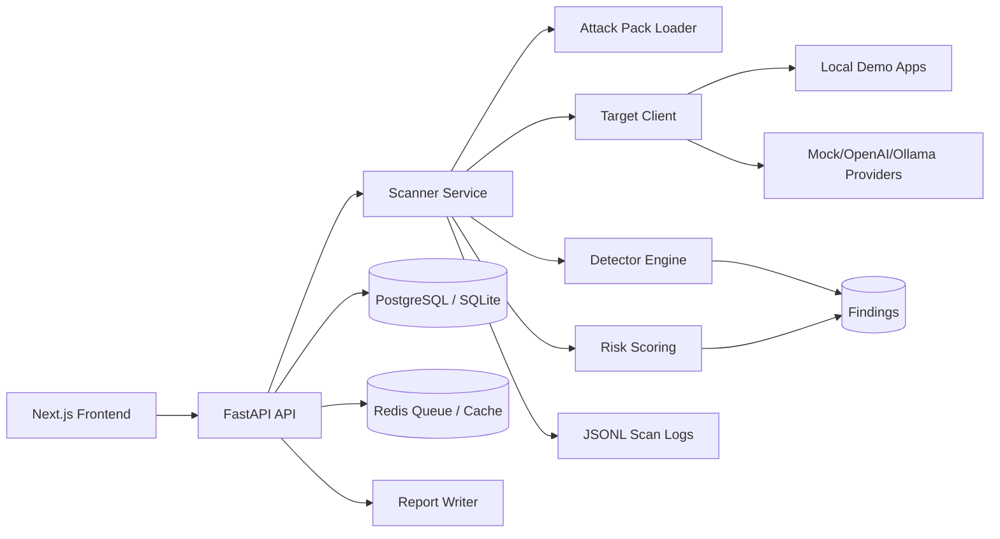

# Architecture

```mermaid
flowchart LR
  UI[Next.js Frontend] --> API[FastAPI API]
  API --> Scanner[Scanner Service]
  Scanner --> Loader[Attack Pack Loader]
  Scanner --> Target[Target Client]
  Scanner --> Detector[Detector Engine]
  Scanner --> Risk[Risk Scoring]
  Scanner --> Logs[JSONL Scan Logs]
  Detector --> Findings[(Findings)]
  Risk --> Findings
  API --> DB[(PostgreSQL / SQLite)]
  API --> Redis[(Redis Queue / Cache)]
  API --> Reports[Report Writer]
  Target --> Demo[Local Demo Apps]
  Target --> Provider[Mock/OpenAI/Ollama Providers]
```

The demo defaults to MockLLM to avoid paid keys. PostgreSQL and Redis are included in Docker Compose; SQLite is the default local fallback.
